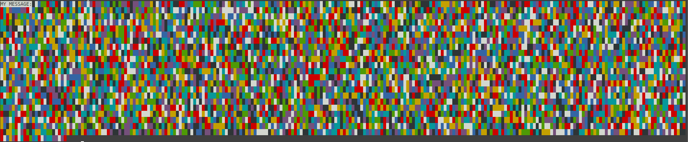

# OASIS CTF (Comprehensive Writeup)

We plced #12 out of around 200 teams in the OASIS CTF '24 conducted by cryptonite and I'll try my best to explain me and my team's thought processes during this 2-day marathon.

Im skipping Challenge 1,2,3 because they donot require intellectual currency to solve.

Might not have some of the flags mentioned because I might've forgotten to save the flag.
## Ready Player One

An audio file was given, it seemed to be morse code and when I ran it through : https://morsecode.world/international/decoder/audio-decoder-adaptive.html

I got the flag : `OASISM0R5EM4N1PU7470R`

We understood that the keys are in leetspeak, a 4chan origin way of coded communication.

----

## Arte-miss

As the darkness recedes, Halliday's voice echoes with the chilling news that Innovative Online Industries (IOI) has seized control of the OASIS. A virus has infected the main server, sparking widespread panic as players lose their progress. Amidst the chaos, Artemis materializes before you, her avatar flickering erratically. With a sense of urgency, she thrusts a file into your hand and whispers something unintelligible before dissolving into a cascade of pixels. Stunned and disoriented, you scrutinize the mysterious file, desperate to understand its significance. Just then, a calming voice cuts through the turmoil—it's Artemis, speaking from the real world. She reveals that the file holds the key to liberating the OASIS from IOI's grip. Though she was captured and her character deleted, she managed to pass this vital piece of information to you in a final act of defiance. Find the flag hidden in the file. 

https://drive.proton.me/urls/VDMJTAVBH4#nCpqsQV4fGjN

If you download the image in the link :


and convert it to base64 and then text using :
https://base64.guru/converter/decode/text
 
 and use ctrl+f to search u get the flag :
 

 Flag: `OASIS{m4ta_af_04515}`

 ---

 ## String me to sleep

 As you delve into the file, reality warps, and you find yourself trapped in a vast, shadowy library, its shelves brimming with countless volumes. The stark realization hits you—the file has captured you within its confines. Your only exit is a door, stubborn and unyielding, lacking any sign of an escape. Desperately, you push and pull at the door, but it remains immovable. Amidst the silence, Artemis' voice reverberates in the air, a spectral guide reminding you that within this labyrinth of books lies the crucial text needed to break free. Instinctively, your mind turns to the one book that could hold the answer: Ready Player One. Find the flag in the following book, following the format OASIS{...}. 

 Attachment : https://drive.proton.me/urls/62HNEMV3W4#nVdDMiFTRnU6

 I opened the library.txt file and searched for `OASIS{` using ctrl+f which got me the flag.

 

 Flag : `OASIS{y0u_fou7d_m3}`

 ---

 ## This or that

 Recognizing the phrase, a golden key materializes in your hand. Your eyes fall upon an engraving on the key—a sequence of characters: 036363127c7c60001a117c6463170b, and on the opposite side, the words ARTEMIS_WHISPER. The cryptic string seems like a puzzle in itself. As you examine it, you realize that the key's true value might not lie in its size but in the secret it carries. The numbers and letters might be concealing a deeper meaning, one that could unlock the door if only you can decipher it. The characters may need to be transformed or combined in a specific way, **exclusively**, or through an unconventional method, to reveal the key's true purpose. The flag format is OASIS{ALL_CAPS}.


 The text is obviously encoded in Hex. I decoded it from Hex into ASCII, But it yields a string with some unreadable characters.  I tried to treat it as a Vigenere Cypher, with ARTEMIS_WHISPER as the key, but that doesn't work.

I trace back my steps and read the question again. I realise the question puts emphasis on the word exclusive. I quickly realise that this implies the XOR operation, the Exclusive or operation. I repeat the key "ARTEMIS_WHISPER" until it maches the size of the decoded Hex and perform an XOR operation on it to get the key.

flag : `OASIS{B17W153_MY573RY}`

## Jekylle And hide 

As you discover the secret of the key, it enlarges and splits into two parts, flying to different areas of the library. You try to follow one, but it's too fast and quickly hides among the books. To recover the key, you need to inspect every part of the library to find both pieces. https://jekylle-and-hide.oasis.cryptonite.live

A simple look at the js files in sources after inspect elementing the page gave me the key.


## Keynough is enough

You find both parts of the key and reach the door, but realize that in order to activate the keyhole you need to decipher an inscription: KHAAH{W1C3J7_C1O3F3G3} on the door. Artemis suggests you WHISPER to it. To crack the code, consider a method that involves a repeating pattern—like adding a touch of vinegar to a recipe to reveal its true flavor. The flag format is OASIS{ALL_CAPS}.

 If a key is given and a cypher is given, It might be a Vigenere cypher. There is also a clue "vinegar" given in the text to indicate this. Decoding the cypher with "WHISPER" as the key yields the answer.


 The flag : `OASIS{S1L3N7_V1G3N3R3}`

 ---

 ## Key-Key do you love me?

Basically had to prompt engineer the discord bot to get the key. I'll let the pictures speak for itself. (reference to HANS NIEMANN)


---

## Knock Knock
 

 At last, the key darts towards the door, a keyhole materializes, and the door swings open. Author''s Note: I don''t know about you, but I was definitely growing tired of this key. You find yourself standing at the entrance of a labyrinth. The only way out is to navigate through the labyrinth itself. However, the entrance is guarded by an image recognition system. A QR code is pasted on the wall beside it. Your task is clear: bypass the system to gain entry. 
 
 Attachment : https://drive.proton.me/urls/8MH5Q996T8#TPFQm3DTEwN5

 Opened up the image in krita cleaned using magic wand and then scanned the qr to get the flag.

 

 ---

## Microsoft StrongEdge


Upon repairing the QR code, you scan it and discover it contains a file. As you meticulously sift through its contents, nothing of value seems to emerge. The mystery deepens—where could the next clue be hidden? The flag is concealed within the file. Sharpen your skills and uncover them! 

Attachment :https://drive.proton.me/urls/3TZSZBC8EC#y0jTotNueZ83


We download the PDF and look through it. We try to look for offslide elements but can't find any. We discover a feature in Powerpoint in the accessibility settings that tells us that there is an offslide element somewhere, which is an image.

Then we converted PPT to zip and extracted


Opened it,


Went to media and then opened the jpeg file to get the flag.


----

## Maze Runner

Aha! So the code extracted from the file opens the labyrinth doors? This is becoming too easy. Now, navigate your way through the labyrinth. It appears to be a straightforward challenge. Flag is the surname of Ideator behind the creation of the labyrinth and the name of the place where the object exists. Flag Format: OASIS{Surname_Location} 

Attachment : https://drive.proton.me/urls/AATXC0NH78#qZ7h3UvtPpqM

Google reverseing the image yields us the name of the structure and its location. I try putting the name of the creator and location in as the flag, but it doesn't work. I keep trying for a while, until I just try to look for more information on the place. I look the Wikipedia page of the labrynth, and find out the Ideator is a different person from the creator of the place. Putting his name in gives us the flag.


## Not noice

You finally find your way to the center of the maze! However, you quickly realize that IOI has discovered your presence. An urgent audio message echoes around you: "There has been a breach in the servers! Send backup immediately! They must not find their way to the…" You strain to catch the rest, but the recording abruptly devolves into a chaotic mix of beeps and garbled words. Can you decipher the true message hidden within the noise? 

Attachment : https://drive.proton.me/urls/N2ATEN2EMR#001mtOYLDqOq

 I Put the audio into the morse code reader website to get the flag :

https://morsecode.world/international/decoder/audio-decoder-adaptive.html

Flag : 


---

## Nom-Nom

The control room door looms before you, locked yet again. Frustration rises, but this isn’t the time to give in. The door is guarded by a … PACMAN?!!. But he doesn’t seem to be moving.. and giving you way. He looks hungry and angry? https://pacman.oasis.cryptonite.live

I inspect element the page to find any information. The first thing that appears is a warning by firefox saying this: ` Cookie “admin” does not have a proper “SameSite” attribute value. Soon, cookies without the “SameSite” attribute or with an invalid value will be treated as “Lax”. This means that the cookie will no longer be sent in third-party contexts. If your application depends on this cookie being available in such contexts, please add the “SameSite=None“ attribute to it. To know more about the “SameSite“ attribute, read :` https://developer.mozilla.org/docs/Web/HTTP/Headers/Set-Cookie/SameSite .
 
This immediately reveals that there is a cookie affecting our admin status. I go to the cookies tab and indeed, there is. I change the admin status from false to true, and this yields the flag.


## Quence Your Thirst

How could the IOI overlook such a critical flaw? You now possess administrative privileges! Surveying your surroundings, you notice the monitor displaying a series of commands accessible only to the admin. However, another security measure is in place—it's encrypted, and only the true admin knows the key. Can you crack this encryption scheme?

Attachment : https://drive.proton.me/urls/ZJSW96F7XM#TqIaYLkuvsQD


My first thought was to try a Caeser cypher, as with any garbled text. This didn't work. I then took a look at the link and realised it was a substitution cypher, and was able to decode it starting with HTTPS.

```
const fs = require('fs');

var text, decrypted;

try {
    text= fs.readFileSync('ciphertext.txt', 'utf8');
} catch (err) {
    console.error('Error reading the file:', err);
}

const letterMap = {
    'a': 'c',
    'b': 's',
    'c': 'u',
    'd': 'h',
    'e': 'g',
    'f': 'l',
    'g': 'a',
    'h': 'w',
    'k': 'd',
    'l': 't',
    'm': 'b',
    'n': 'm',
    'o': 'o',
    'r': 'k',
    'q': 'i',
    's': 'e',
    't': 'y',
    'v': 'v',
    'w': 'p',
    'x': 'f',
    'y': 'r',
    'z': 'n'
}

function decryptString(input) {
    return input.split('').map(char => {
        return letterMap[char.toLowerCase()] || char.toLowerCase(); 
    }).join('');
}

decrypted = decryptString(text)

try {
    fs.writeFileSync('decrypted.txt', decrypted, 'utf8');
    console.log('File has been written successfully.');
} catch (err) {
    console.error('Error writing to file:', err);
}

```
 We get a katb link : `Katb.in/YUNIORPJ`, However this link is broken. I realised that only 20 or so alphabet had some sort of mapping to another alphabhet, and some of the alphabets without any mapping were in the Link. This means that these alphabets could be replace with any other alphabet, and after trying to brute force for a bit we tried using unique alphabets not used in the cypher and all of them unique. We got around 24 links using node js :

 ```const fs = require('fs');

const inputString = "https://katb.in/Y_N_OR__";
const letters = ['J', 'Q', 'X', 'Z'];

// Function to generate all permutations of an array
function getPermutations(arr) {
    if (arr.length === 0) return [[]];
    
    const permutations = [];
    for (let i = 0; i < arr.length; i++) {
        const remaining = [...arr.slice(0, i), ...arr.slice(i + 1)];
        const remainingPermutations = getPermutations(remaining);
        
        for (let perm of remainingPermutations) {
            permutations.push([arr[i], ...perm]);
        }
    }
    
    return permutations;
}

// Function to replace underscores with a given permutation
function replaceUnderscores(str, replacement) {
    let currentIndex = 0;
    return str.replace(/_/g, () => replacement[currentIndex++]);
}

// Generate all permutations of the letters
const permutations = getPermutations(letters);

// Store the results in an array
const resultArray = permutations.map(perm => replaceUnderscores(inputString, perm));

// Write the array to a JSON file
fs.writeFileSync('permutations.json', JSON.stringify(resultArray, null, 2));

console.log('Permutations have been saved to permutations.json');

```

```
const fs = require('fs');

const inputString = "https://katb.in/Y_N_OR__";
const letters = ['J', 'Q', 'X', 'Z'];

// Function to generate all permutations of an array
function getPermutations(arr) {
    if (arr.length === 0) return [[]];
    
    const permutations = [];
    for (let i = 0; i < arr.length; i++) {
        const remaining = [...arr.slice(0, i), ...arr.slice(i + 1)];
        const remainingPermutations = getPermutations(remaining);
        
        for (let perm of remainingPermutations) {
            permutations.push([arr[i], ...perm]);
        }
    }
    
    return permutations;
}

// Function to replace underscores with a given permutation
function replaceUnderscores(str, replacement) {
    let currentIndex = 0;
    return str.replace(/_/g, () => replacement[currentIndex++]);
}

// Generate all permutations of the letters
const permutations = getPermutations(letters);

// Store the results in an array
const resultArray = permutations.map(perm => replaceUnderscores(inputString, perm));

// Write the array to a JSON file
fs.writeFileSync('permutations.json', JSON.stringify(resultArray, null, 2));

console.log('Permutations have been saved to permutations.json');
```


```
anon = [
  "https://katb.in/YJNQORXZ",
  "https://katb.in/YJNQORZX",
  "https://katb.in/YJNXORQZ",
  "https://katb.in/YJNXORZQ",
  "https://katb.in/YJNZORQX",
  "https://katb.in/YJNZORXQ",
  "https://katb.in/YQNJORXZ",
  "https://katb.in/YQNJORZX",
  "https://katb.in/YQNXORJZ",
  "https://katb.in/YQNXORZJ",
  "https://katb.in/YQNZORJX",
  "https://katb.in/YQNZORXJ",
  "https://katb.in/YXNJORQZ",
  "https://katb.in/YXNJORZQ",
  "https://katb.in/YXNQORJZ",
  "https://katb.in/YXNQORZJ",
  "https://katb.in/YXNZORJQ",
  "https://katb.in/YXNZORQJ",
  "https://katb.in/YZNJORQX",
  "https://katb.in/YZNJORXQ",
  "https://katb.in/YZNQORJX",
  "https://katb.in/YZNQORXJ",
  "https://katb.in/YZNXORJQ",
  "https://katb.in/YZNXORQJ"
]
```

The above script was used to find the permutations

After trying all of them using a python script. 
We acquired the flag.

Flag : `OASIS{fr3qu3nt_j4!l_br34k1ng_m4k3s_!t_t00_3asy_fr}`


## Git Gud

You decrypt the code and follow all the commands. However, as you think you have breached the firewall, the screen goes black and random numbers start glitching on the screen. You realize that the OASIS realizes that they have left admin privileges and are messing with the computer in order for you not to be able to perform the final push. 

Attachment : https://drive.proton.me/urls/NPCS7GTQPM#EDDwiQ6UtuKg


Unzipping the folder reveals a pdf. I look through the pdf. It's a research paper with nothing of note. I then go back and try to look at the file again. I then unhide my hidden files in my file explorer, and find a `.git` folder. 


I opened it in VSCODE and if we check the commits using source control, we find the flag.


---

## Stairway to Heaven

The ground beneath you trembles as Tetris blocks rain from the shadows, cascading down like a storm. At first, panic sets in, but then you realize: these blocks aren't meant to crush you—they're your escape. Each piece, carefully arranged, could form a staircase to the control room floating above in the void. It's time to use them strategically and rise to safety. Stack the blocks and find your way out! 

Attachment : https://drive.proton.me/urls/ZJSW96F7XM#TqIaYLkuvsQD


After running the file using `chmod +x game` and
`./game`
 in a linux terminal we get this output :



After copying the pattern and pasting it into a txt file, There's a section that stands out as it contains ASCII decimal values:
`"79 65 83 73 83 123 118 51 52 121 95 102 52 110 99 121 95 65 78 53 73 125"`

When converting these ASCII values to text, it reveals:
`"OASIS{v34y_f4ncy_AN5I}"`


## I have been falling for 30 minutes!
 
 It hits you! The IOI uses an encrypted communication service to control the virus's every move. Your mission is clear: sever the link between the IOI and the virus to isolate and defeat it. However, you linger too long in one place, and the IOI catches wind of your plan. Fortunately for them, they have a firewall jail just beneath the surface. The ground trembles and splits open, sending you plummeting into the abyss. You land with a resounding THUD, surrounded by towering firewalls. You see a computer in the middle of the cell, and feel like you can use it to your advantage. Can you break free from this digital prison?
 
  https://firewall.oasis.cryptonite.live

 Played around with the link for a minute and set the number in the link as -1. Yielded me the flag. 

 


## Heads up, tails down

Finally, you step into the admin control room. Decay has overtaken the space—screens flicker, panels glitch, and virus-riddled code runs rampant across every surface. The system is on the brink of collapse. You sit at the central terminal, but it's unresponsive, frozen by the infection. It's up to you to repair the system and revive the decaying screens. Only then can you regain control. 

Attachment : https://drive.proton.me/urls/475BPAQZ44#S4D5x7911lhg

A corrupted PNG. I look through the text file of the png for the flag, but there is nothing of note. Only hint is that the 1st line says fix_meto_crackme, Which means we have no option other than fixing the png. I try some online png "fixers", to uncorrupt an image, but it doesn't work. I look through the txt file, And find repetetive text. I remove it, but it still doesn't work. I try to convert the file into a png, gif, avif, But that also doesn't work.

I learn about how a png is structured using :
http://www.libpng.org/pub/png/spec/1.2/PNG-Structure.html
 
We took a random SS in png format and copied it's header and changed the header(first line) using `Hexed.it` to Fix the png and got the flag.

## All that for a drop of blood

I inspect element the page and try to find something. Nothing was found. When I click play, it does a POST request, 


I try to look through the cookies, But nothing was found. Somehow the website is authenticating us without storing anything on our machine. This means that everything is done on their server. Doing research online suggest packet manipulation. I installed Burp Suite, An application for intercepting packets. I intercept the packets going from my browser to the website.


I intercepted the packets to modify the packets at each interval to get the flag using :

```
POST /game?player=OASIS HTTP/1.1
Host: startgame.oasis.cryptonite.live
Content-Length: 36
Sec-Ch-Ua: "Not;A=Brand";v="24", "Chromium";v="128"
Content-Type: application/json
Accept-Language: en-GB,en;q=0.9
Sec-Ch-Ua-Mobile: ?0
User-Agent: OASISPlayer
Sec-Ch-Ua-Platform: "macOS"
Accept: /
Origin: https://startgame.oasis.cryptonite.live/
Sec-Fetch-Site: same-origin
Sec-Fetch-Mode: cors
Sec-Fetch-Dest: empty
Referer: https://startgame.oasis.cryptonite.live/?name=cryptonite
Accept-Encoding: gzip, deflate, br
Priority: u=1, i
X-OASIS-Player: true
----------
POST /game?name=CRYPTONITE HTTP/1.1
Host: startgame.oasis.cryptonite.live
Content-Length: 36
Sec-Ch-Ua: "Not;A=Brand";v="24", "Chromium";v="128"
Content-Type: application/json
Accept-Language: en-GB,en;q=0.9
Sec-Ch-Ua-Mobile: ?0
User-Agent: OASISPlayer
Sec-Ch-Ua-Platform: "macOS"
Accept: /
Origin: https://startgame.oasis.cryptonite.live/
Sec-Fetch-Site: same-origin
Sec-Fetch-Mode: cors
Sec-Fetch-Dest: empty
Referer: https://startgame.oasis.cryptonite.live/?name=cryptonite
Accept-Encoding: gzip, deflate, br
Priority: u=1, i
X-OASIS-Player: true
-----
POST /givemetheFlag?name=CRYPTONITE&rank=4 HTTP/1.1
Host: startgame.oasis.cryptonite.live
Content-Length: 36
Sec-Ch-Ua: "Not;A=Brand";v="24", "Chromium";v="128"
Content-Type: application/json
Accept-Language: en-GB,en;q=0.9
Sec-Ch-Ua-Mobile: ?0
User-Agent: OASISPlayer
Sec-Ch-Ua-Platform: "macOS"
Accept: /
Origin: https://startgame.oasis.cryptonite.live/
Sec-Fetch-Site: same-origin
Sec-Fetch-Mode: cors
Sec-Fetch-Dest: empty
Referer: https://startgame.oasis.cryptonite.live/?name=cryptonite
Accept-Encoding: gzip, deflate, br
Priority: u=1, i
X-OASIS-Player: true 
```


## A Rocky Start


